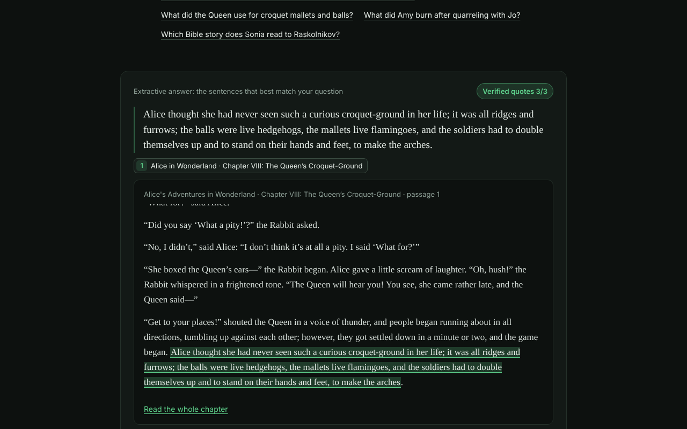

# Marginalia

Ask questions about twelve classic novels and get answers that cite the text. Every quote in an answer is checked word for word against the passage it cites, and the page shows its working: which passages were retrieved, how they scored, and which quotes passed.



The books (all from [Project Gutenberg](https://www.gutenberg.org/), public domain in the US): Pride and Prejudice, Moby-Dick, Frankenstein, Dracula, Jane Eyre, Great Expectations, The Great Gatsby, Alice's Adventures in Wonderland, The Picture of Dorian Gray, Crime and Punishment (Constance Garnett translation), A Tale of Two Cities and Little Women. About 1.6 million words.

## What it does

1. **Retrieve.** The books are split into paragraph-based chunks of about 240 words that never cross a chapter boundary and overlap by one short paragraph. Each chunk keeps its book, chapter, paragraph range, character offsets and source line. Search is BM25 (a standard keyword ranking formula) with stemming and stopwords, plus three additions: a boost when query words appear next to each other in a chunk, a boost for a book named in the question, and a share of the best neighboring chunk's score, since a scene often names its characters a paragraph before the event. You can limit the search to some books with the filter chips.
2. **Answer.** With `ANTHROPIC_API_KEY` (or `OPENAI_API_KEY`), a model reads the top eight passages and returns JSON where every claim carries exact quotes from numbered passages. With no key, the answer is extractive: the three sentences from the top five passages that best cover the question's rarer words.
3. **Check.** The grounding validator looks for each quote in the passage it cites. It ignores whitespace, quote-mark style, dash style, letter case and the underscores Gutenberg uses for italics. An ellipsis splits a quote into pieces, and each piece must be found, in order. A quote that fails is shown as "unverified", never dropped silently. If a model answer has failures, the model gets one retry with the failures listed. The answer card shows a "Verified quotes n/n" badge.

Optional hybrid retrieval: if `OPENAI_API_KEY` is set when you run `npm run embed`, every chunk is embedded with `text-embedding-3-small` and search fuses BM25 and vector rankings with reciprocal rank fusion (RRF). Without the key, retrieval is BM25 only.

## Measured

`npm run eval` scores retrieval on 46 hand-checked questions plus 12 held-out ones, and runs the validator against planted fake quotes. Current numbers (from `evals/results/summary.md`):

| | R@1 | R@5 | R@10 | MRR |
|---|---|---|---|---|
| Plain BM25, 160-word chunks | 30.4% | 52.2% | 56.5% | 0.392 |
| Shipped config | 34.8% | 58.7% | 65.2% | 0.452 |
| Shipped config, held-out questions | 41.7% | 58.3% | 58.3% | 0.475 |

The validator caught 320/320 planted fake quotes and passed 136/136 real ones. With a real model (`claude-haiku-4-5`, one run over all 58 questions), 62 of 67 quotes passed the check on the first reply, and when a gold passage was among the eight retrieved the model quoted it 34 times out of 35; see `evals/results/model-claude-haiku-4-5.md`. Keyword search is weak on paraphrased questions (25% R@10). That is the case vector search is for. The hybrid path is built but has no eval numbers yet. See [PROOF.md](PROOF.md) for the error analysis, what changed and what is not verified.

## Run it

Needs Node 22.

```sh
npm install
npm run dev            # http://localhost:3000, no key needed
npm test               # 61 tests, no network
npm run eval           # writes evals/results/
npm run build && npm start
```

The processed corpus (`data/corpus/*.json`, 9.4 MB) is committed, so nothing is downloaded at build time. To rebuild it from Gutenberg, run `npm run corpus` (downloads about 10 MB into `data/raw/`, which is git-ignored). The build checks each book's chapter count and fails loudly if a parse goes wrong.

## API

- `POST /api/ask` with `{"question": "...", "books": ["dracula"]}` (books optional). Returns the answer, each quote's validator result with offsets into the passage, the retrieved passages with scores and ranks, and timings.
- `GET /api/passage?id=dracula:1:3` returns one chunk with the paragraphs before and after it.
- `GET /api/books` lists the books.
- `GET /read/:book/:chapter?from=&to=` renders a chapter with the cited paragraphs marked.
- `GET /health`

Limits: questions up to 400 characters, request bodies up to 4 KB, `ASK_PER_MINUTE` requests per IP per minute (default 12), `DAILY_LLM_LIMIT` model calls per UTC day across all visitors (default 200; after that, answers are extractive with a notice), and a timeout on every model call. Visitors never see stack traces or upstream error bodies.

## Environment

See `.env.example`. All optional.

| Variable | Default | |
|---|---|---|
| `ANTHROPIC_API_KEY` | | Model answers with Claude |
| `ANTHROPIC_MODEL` | `claude-haiku-4-5` | |
| `OPENAI_API_KEY` | | Model answers when there is no Anthropic key; query embeddings for hybrid search |
| `OPENAI_MODEL` | `gpt-4.1-mini` | |
| `EMBEDDING_MODEL` | `text-embedding-3-small` | |
| `DAILY_LLM_LIMIT` | `200` | Model calls per UTC day |
| `ASK_PER_MINUTE` | `12` | Per IP |
| `LLM_TIMEOUT_MS` | `25000` | |
| `TRUST_PROXY` | | `1` to read the client IP from `X-Forwarded-For` (on automatically on Render) |
| `PORT` | `3000` | |

## Deploy

**Render** (free plan): New > Blueprint > pick this repo. `render.yaml` sets the build (`npm ci --include=dev && npm run build && node dist/scripts/embed.js`), the start command and the `/health` check. Add `ANTHROPIC_API_KEY` and/or `OPENAI_API_KEY` in the dashboard if you want model answers. The embed step only runs when `OPENAI_API_KEY` is set at build time (the whole corpus, about 1.6 million words, goes through the embeddings API once per build) and writes `data/embeddings/`, which is not committed. Free instances sleep when idle, so the first request after a nap takes a while; startup itself (load and index the corpus) takes about 2 seconds.

There is no `vercel.json`. The server builds its search index in memory at startup and keeps rate limits in memory, which suits one long-running instance better than serverless functions.

## Layout

```
src/corpus/   books.ts (per-book parse rules), parse.ts, chunk.ts
src/search/   tokenize.ts, bm25.ts, fusion.ts (RRF), vectors.ts, retrieve.ts
src/answer/   validate.ts, extractive.ts, llm.ts, ask.ts
src/server/   app.ts (Hono routes), reader.ts, rate-limit.ts
src/eval/     run.ts
scripts/      build-corpus.ts, embed.ts, screenshots.ts
evals/        questions.json, holdout.json, results/
public/       the page (plain HTML, CSS and JS, no build step)
```

## License

Code: MIT. Book texts: public domain in the US, from Project Gutenberg.
